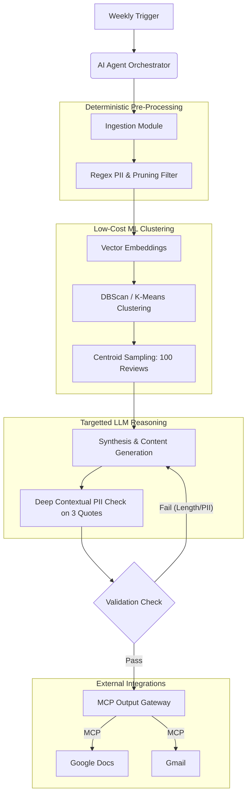

# Architecture Design: Groww Weekly Pulse (Token-Optimized)

This document outlines the system architecture for the Groww Weekly Pulse automation. It defines the core modules, their responsibilities, boundaries between deterministic and AI-driven processes, and the data flow. 

Crucially, this architecture is designed for **maximum token efficiency**. It heavily utilizes deterministic filtering and vector embeddings to avoid pushing large raw datasets into expensive LLM context windows, while integrating with Gmail and Google Docs via an MCP (Model Context Protocol) server.

---

## 1. Major Modules & Responsibilities

The system is designed as an agentic workflow orchestrated by a central AI Agent. 

### 1.1 Trigger & Orchestration Module
*   **Responsibility:** Acts as the central nervous system. Manages the weekly schedule, invokes downstream modules in sequence, and handles the state of the pipeline.

### 1.2 Ingestion & Pruning Module (Deterministic)
*   **Responsibility:** Automatically scrapes live reviews from the Play Store ("com.nextbillion.groww") and App Store ("Groww Stocks, Mutual Fund IPO App") covering the last 8–12 weeks. Crucially, it prunes low-value data (e.g., reviews < 4 words, exact duplicates, non-target languages) and runs standard regex PII scrubbing to dramatically reduce the dataset size before any AI touches it.

### 1.3 Vector Embedding & Clustering Module (Deterministic/ML Hybrid)
*   **Responsibility:** Converts the pruned reviews into vector embeddings using a low-cost embedding model. It then groups these vectors into clusters using a deterministic algorithm (like HDBSCAN or K-Means) and samples the top 20 most central, representative reviews from the top 5 clusters.

### 1.4 Synthesis & Content Generation Module (AI)
*   **Responsibility:** Receives only the small sample (e.g., 100 representative reviews) from the clustering module. Its job is to assign human-readable theme names mapped to user journeys (e.g., onboarding, KYC), extract the top 3 quotes, and generate 3 concrete action ideas within a strict ≤250-word format.

### 1.5 Deep PII Validation Module (AI/Deterministic Hybrid)
*   **Responsibility:** Runs a deep contextual LLM PII scrub *only* on the final 3 quotes selected for publication, ensuring no disguised PII leaks into the final draft, alongside a deterministic word count check.

### 1.6 Output & Integration Module (MCP Gateway)
*   **Responsibility:** Interfaces with the MCP Server to persist the pulse note into Google Docs (for archival and internal sharing) and drafts the final email in Gmail.

---

## 2. Data Flow

1.  **Trigger:** The weekly schedule initiates the Orchestration Module.
2.  **Fetch & Prune:** The Ingestion Module pulls raw exports, runs regex PII scrubbing, and drops spam/short reviews (e.g., 100k reviews pruned to 20k).
3.  **Embed & Cluster:** The 20k reviews are converted to vectors (cheap) and clustered deterministically.
4.  **Sample:** The system extracts the top 5 largest clusters and pulls the 20 most central reviews from each, outputting exactly 100 highly representative reviews.
5.  **Synthesize (LLM):** The Content Generation Module reads only these 100 reviews to determine the top 3 themes, pick 3 quotes, and write the 3 action ideas.
6.  **Deep Scrub (LLM) & Validate:** The LLM does a final pass on the 3 chosen quotes to ensure zero disguised PII. A deterministic check ensures the note is under 250 words.
7.  **Publish:** The Orchestrator hands the validated text to the Output Module.
8.  **Integrate (MCP):** The Output Module calls the MCP Server to:
    *   Create a new Google Doc containing the pulse note.
    *   Draft an email in Gmail containing the note and a link to the Google Doc.

### Architecture Diagram

---

## 3. AI vs. Deterministic Boundaries

To ensure token efficiency and high reliability, responsibilities are strictly divided.

### Deterministic Boundaries (High Volume, Zero Token Cost)
*   **Pipeline Execution:** Scheduling and module transitions.
*   **Data Ingestion & Pruning:** Fetching data, dropping short reviews (< 4 words), removing duplicates, dropping non-target languages.
*   **Initial PII Scrubbing:** Regex-based removal of emails, phone numbers, and standard ID formats.
*   **Clustering Math:** Using algorithms like HDBSCAN on the generated vector embeddings.
*   **Output Validation:** Enforcing the 250-word limit.
*   **MCP Integration:** API communication with Gmail and Google Docs.

### AI / LLM Boundaries (Low Volume, High Reasoning)
*   **Vector Embeddings:** Using a cheap embedding model (e.g., text-embedding-3-small) on the pruned dataset.
*   **Semantic Synthesis:** Reading the 100-review sample to generate theme titles, action ideas, and extract quotes.
*   **Contextual PII Scrubbing:** Checking only the final 3 quotes for disguised PII (e.g., "my pan number is abcde 1234 f") that regex misses.

---

## 4. Integrations

The system relies heavily on the **Model Context Protocol (MCP)** to interact safely with external services.

*   **App/Play Store Data Sources:** Standard HTTP/File integrations for raw data ingestion.
*   **Google Docs (via MCP):** Used to generate and store a persistent, collaborative copy of the weekly pulse note for historical tracking.
*   **Gmail (via MCP):** Used to auto-draft the final email to the designated alias, complete with formatting and the Google Doc link, ready for manual review and sending.

---

## 5. Failure Handling

*   **Ingestion Failures:** Implement exponential backoff retries. If the data source is persistently unavailable, the Orchestrator halts and drafts an alert email instead of a pulse note.
*   **PII Validation Failures:** If the deep PII check detects potential PII in a quote, the pipeline rejects that quote and prompts the LLM to select an alternative from the 100-review sample.
*   **Hallucination/Format Failures:** If the AI generates >250 words, the deterministic validator catches this and prompts the AI to condense the format.
*   **MCP Integration Failures:** If Gmail or Google Docs are unreachable, the Output Module queues the final note locally and retries delivery periodically.

---

## 6. Observability

*   **Token Usage Metrics:** Strict tracking of embedding tokens vs. LLM generation tokens to ensure the "funnel" is working and costs remain low.
*   **Pruning Metrics:** Tracking the volume of raw reviews vs. pruned reviews to detect anomalies in data quality.
*   **Pipeline State Logs:** Deterministic logging of each module's start/success/fail state.
*   **Alerting:** Alerting the technical owner upon fatal pipeline errors, consistent validation loop failures, or sudden spikes in token usage.
